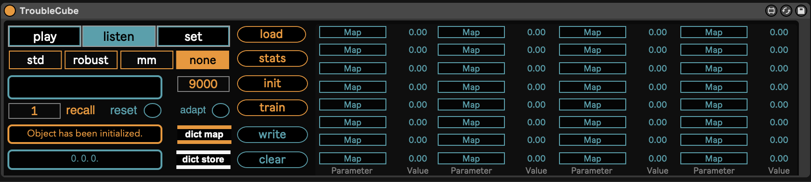

# TroubleCube

TroubleCube is a 3D high level interface tool to automatic program and control digital music instrumnts (DMI) inside Ableton Live.

## Introduction

TroubleCube allows to organise the different presets of DMIs, starting from the instruments' parameters values, in a two steps process. First, through unsupervised dimensionality reduction techniques it is possible to represent the parameters’ values as points in a three-dimensional space. Second, running a linear regression routine on this parameters’ collection, it is possible to build a three-dimensional map that allows to smoothly morph between all the vectors and thus between any point inside the map. Eventually the virtual space can be navigated using the mouse, or a different device, e.g. a smartphone, using the TroubleCube_sender Max patch.
It is worth to point out that the overall current apporach is heuristic. Hence using TroubleCube the focus is to achieve an agnostic macro-control learning with morphing capabilities and not to unveil the true relation between auditory and parameter space. TroubleCube can be used to control a single device, or even entire chains of effects collected inside one of Live's Rack instruments. 
TroubleCube is agnostic on the device it is applied to, it can be equally be used with Live's native or M4L instruments, audio and midi effects as well as to VST and AU plug-ins.

## Requirements

In order to use TroubleCube the following additional pieces of software are required:

- Ableton Live (even trial)
- rapid.regression external, available at https://github.com/mzed/rapid
- Max and the CNMAT odot max package, available from the Max's package manager or at https://github.com/CNMAT/CNMAT-odot/releases. The odot package is necessary only to run the TroubleCube_sender max patch.

## Usage

The tool is made of two components: a python script to reduce the instrument's parameters to a system of three-dimensional coordinates and a Max for Live plugin to display the virtual space and map the values to the instrument's parameters.

1. Open Ableton Live and choose the instrument or the chain you want to control.

2. Put TroubleCube in the effect chain after the device.

3. Select either "listen" to control VST and AU plug-ins or "set" mode if you want to work with Live's native devices or M4L plug-ins. Using "listen" mode you can select the presets to be stored and reduced directly from the plug-in you want to control. The values will be automatically sent to TroubleCube and properly scaled. If you are dealing with categorical parameters you may have to create an "adapt scheme". For detailed instructions, open the TroubleCube plug-in and check the subpatch "adapt-scheme". 
When working in "set" mode the values of the device you want to control will not be reflected inside TroubleCube, therefore you have to set the parameters of the device from the number boxes at the right of the map buttons inside TroubleCube.

4. Each time you find an interesting preset assign a name to it using the textbox on the left side of TroubleCube, according to the scheme <bankname_presetname>. Click outside the textbox and press the return key. Check that the preset's values have been registered by double clicking on "dict store" object.

5. Store at least 3 presets and possibly no more than 10. You can store even more than 10 presets, but the accuracy of the generated map will decrease.

6. Once you are done press the "write" button and assign a name to the file. Now a .json file containing all the presets' values has been saved on the disk. You need this file to create the "map" file.

7. In order to create a map and its associated statistics you need to run the python script. It is recommended to run the script inside a virtual environment e.g. Miniconda or Poetry. 
Using conda for example, once you cloned the repository "cd" to the root folder and run:

    conda create --name <environment_name> python==3.9.16

    conda activate <myenv>

    pip install -r requirements.txt

Ensure that 'pip' is available within your environment and make sure to activate the environment before installing the requirements.

8. To get an overview of the script's arguments, type in the terminal:

    python device2map.py -h

9. To generate a map and the statistics type:

    python device2map.py -scaler <scaling_method> -dim <reduction_technique> <path_to_presets_file> <map_name>

This command will create a map file in the "maps" folder inside the root and a "mimax" file inside the "statistics" folder, necessary to use the TroubleCube_sender. If a further scaling step has been selected another json file for back-scaling has been created as well.

10. Inside TroubleCube set the device to "play" mode. Press the "load" button and select the map file. If you selected a further scaling technique in the script, select it accordingly in the TroubleCube menu. You also need to load the statistics file by selecting the "stats" button. If no other scaling was applied just set the TroubleCube menu to "none". In this case you do not have to load the statistics file. If you created an adapt scheme be sure this one has been loaded as well by selecting the "as" button. Once you are done press "init" then the "train" button.

11. If you went through all the previous steps correctly you should see the presets represented as points inside the 3D GUI with their names on the right. Now you are able to automatically program the instrument by moving the white torus inside the 3D GUI and exploring the virtual space. The number boxes at the right of the "map" buttons should reflected the value that is currently sent to the DMI you are controlling. Using the "recall" number box you can automatically recall any preset.
To move the torus you can use the computer's keyboard as follows:

    a / d: left / right
    w / z: up / down
    s / x : rear / front

12. When you find a spot of the space that sounds interesting, you can store it by assiging a name as you did in step 4. The point will be immediately represented in the virtual space with the name associated to it. Please do not forget to save again the map file by pressing the "write" button. 

13. If you want to control the instrument from an external device, open the TroubleCube_sender max patch and follow the instructions inside. Do not forget to edit it accordingly with the sensors you will use and to load the "mimax...json" file that has been stored in the "statistics" folder inside the route

## Limitations

TroubleCube is still a prototype therefore it has some significant limitations.
The reduction routine is still basic this means that reducing more than 8-10 presets at once may result in a significant loss of accuracy when those will be retrieved from the virtual space and it is not recommended.
Due to performance reasons, and the fact that OSC is not usually implemented in commercial plug-ins, TroubleCube only supports the mapping of 32 parameters. An OSC version will be released soon. Drawing trajectories between the points inside the virtual space it is not supported in the current version.

